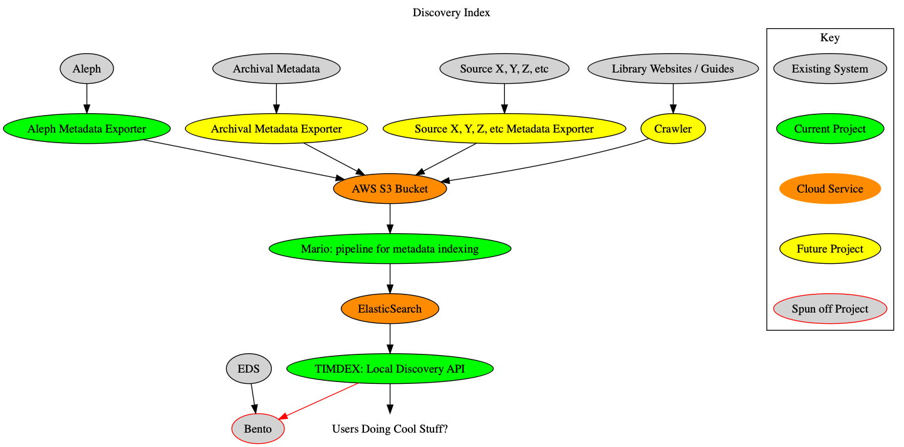
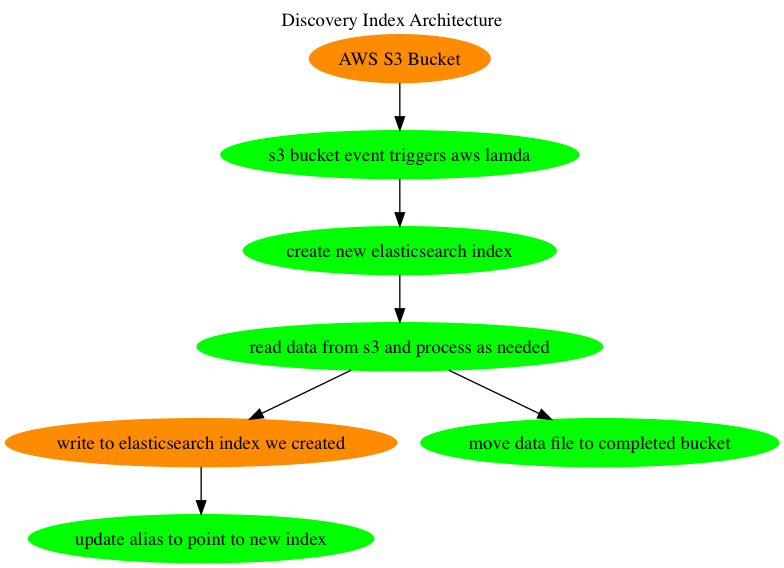

# Mario

## What is this?

Mario is a metadata processing pipeline that will process data from various
sources and write to Elasticsearch.

## Installing

The `mario` command can be installed with:

```
$ go get github.com/mitlibraries/mario
```

## How to Use This

An Elasticsearch index can be started for development purposes by running:

```
$ docker run -p 9200:9200 -p 9300:9300 -e "discovery.type=single-node" \
    docker.elastic.co/elasticsearch/elasticsearch:6.4.2
```

Create and configure the index with:

```
$ mario create
```

The Mario container can be built and used by running:

```
$ docker build -t mario .
$ docker run --rm -i mario parse -c title - < fixtures/test.mrc
```

## Developing

This project uses modules for dependencies. To upgrade all dependencies to the latest minor/patch version use:

```
$ go get -u ./...
```

Tests can be run with:

```
$ go test -v ./...
```

## System Overview


## Architecture Overview


## Architecture Decision Records

This repository contains Architecture Decision Records in the
[docs/architecture-decisions directory](docs/architecture-decisions).

[adr-tools](https://github.com/npryce/adr-tools) should allow easy creation of
additional records with a standardized template.
