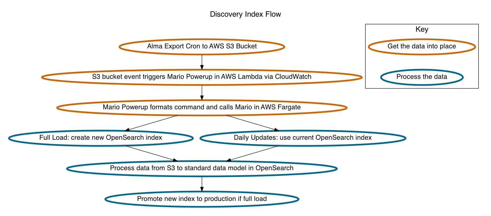

# Mario

## What is this?

Mario is a metadata processing pipeline that will process data from various
sources and write to Elasticsearch.

## System Overview

## Architecture Overview

## Architecture Decision Records

This repository contains Architecture Decision Records in the
[docs/architecture-decisions directory](docs/architecture-decisions).

[adr-tools](https://github.com/npryce/adr-tools) should allow easy creation of
additional records with a standardized template.
